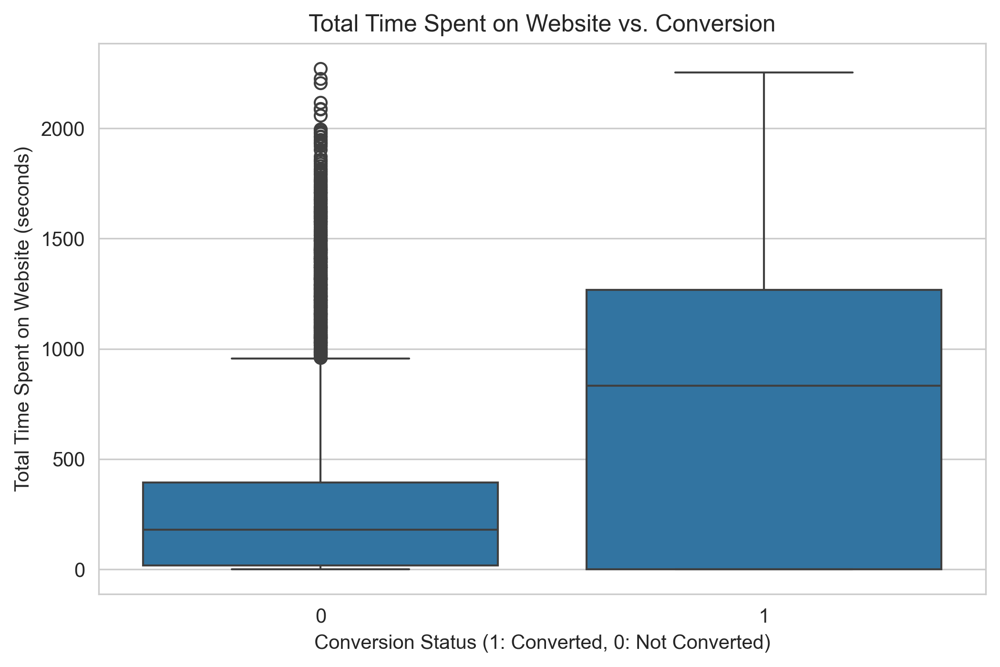
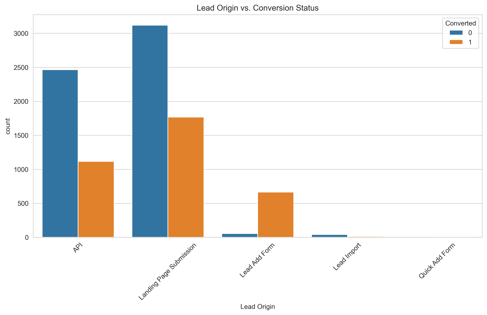
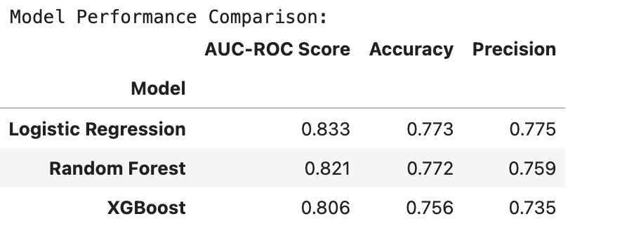

# Predictive Lead Scoring for Ed-Tech Sales Optimization

### Problem Statement

This project builds a machine learning model that predicts the conversion probability of leads for an educational technology company. By assigning a predictive lead score, the sales team can effectively prioritize their efforts on high-potential prospects, thereby increasing efficiency and boosting conversion rates.

### Dataset Link

The analysis was performed on the Lead Scoring dataset from Kaggle.
[Link to Dataset](https://www.kaggle.com/datasets/ashusri4/leadscoring)

---

### Methodology & Key Steps

1.  **Exploratory Data Analysis (EDA):** Investigated the relationships between lead attributes and the final conversion status.
2.  **Data Preprocessing:** Cleaned the data by handling missing values and encoded categorical variables using one-hot encoding.
3.  **Model Building:** Developed and compared three classification models: Logistic Regression, Random Forest, and XGBoost.
4.  **Model Evaluation:** Assessed models based on their AUC-ROC score, Accuracy, and Precision to select the best-performing algorithm.

---

### Key Findings & Visualizations

* **Finding 1:** Leads who spend more time on the website have a significantly higher conversion rate. This is the single most important behavioral metric for predicting conversion.
    * 

* **Finding 2:** The lead's origin is a powerful predictor. Specifically, leads generated through the "Lead Add Form" convert at a very high rate and should be prioritized.
    * 

---

### Model Performance

The XGBoost classifier demonstrated the best performance across all key metrics.

---

### How to Run

1.  Clone this repository.
2.  Install the required libraries: `pip install pandas numpy matplotlib seaborn scikit-learn xgboost jupyter`
3.  Open and run the `lead_scoring_analysis.ipynb` Jupyter Notebook.